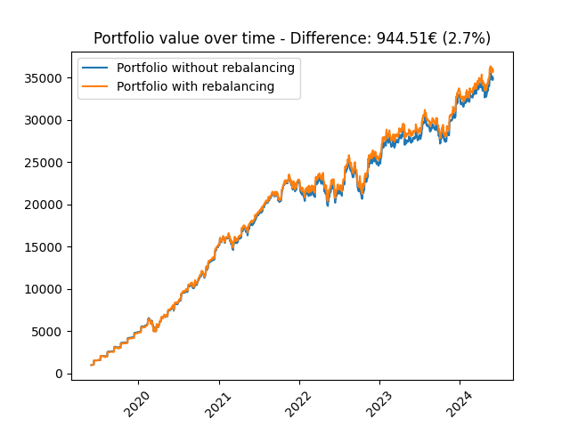

# Portfolio Rebalancing Simulator

This Python repository contains a script designed to simulate the rebalancing of a financial portfolio. It demonstrates the potential benefits of rebalancing through a side-by-side comparison with a portfolio that does not use rebalancing strategies. This project uses Python libraries such as Pandas for data handling and Matplotlib for visualization.

## Features

- Simulates portfolio investments over time.
- Compares rebalanced vs. non-rebalanced portfolio strategies.
- Uses historical stock data to simulate real-world investment scenarios.
- Plots the portfolio values over time, highlighting the difference in final values and percentage gains.

## Installation

Before running the simulation, you must have Python installed on your system. This script was developed using Python 3.8, but it should be compatible with any recent version.

1. **Clone the Repository**
'''
git clone git@github.com
/Portfolio_Rebalancing_Strategie.git
cd Portfolio_Rebalancing_Strategie
'''

2. **Install Required Libraries**
- Ensure you have `pip` installed on your computer.
- Install the necessary libraries using:
  ```
  pip install -r requirements.txt
  ```
This will install all the required libraries listed in the `requirements.txt` file, such as Pandas and Matplotlib.

## How It Works

The script uses classes to represent the configuration, stocks, and portfolio. Here’s a brief overview of the main components:

- `Config`: Stores initial investment, monthly investment, and leverage settings.
- `Stock`: Manages individual stock data, including loading historical prices and interpolating values for missing dates.
- `Portfolio`: Manages a collection of stocks, applies daily price changes, and optionally performs monthly rebalancing based on the configured strategy.

### Simulation Process

1. **Initialize Stocks and Portfolio:** Stocks are initialized with their names and target percentages in the portfolio. The portfolio is initialized with or without the rebalancing option.
2. **Simulate Daily Investments:** The portfolio value is updated daily based on stock price changes. On the 15th of each month, additional investments are distributed among the stocks.
3. **Rebalancing (if enabled):** Adjusts the investment in each stock to match the target distribution, using leverage to amplify adjustments.

### Visualization

- **Plot Portfolio Values:** Plots the growth of the portfolio over time, comparing rebalanced and non-rebalanced strategies.
- **Difference Calculation:** Calculates and displays the monetary and percentage difference between the two strategies at the end of the simulation period.

## Example Visualization

Below is the example output visualization of the portfolio values over time, which is generated by the script and saved as `portfolio_value.png` in the repository:



## License

This project is licensed under the MIT License - see the [LICENSE](LICENSE) file for details.

## Contributing

Contributions are welcome! Please feel free to submit pull requests or open issues to discuss potential changes or improvements.

## Authors

- **Luca Burghard**

For any questions or further information, feel free to contact me at your-email@example.com.

## Support

For support, please open an issue on the GitHub repository page.
